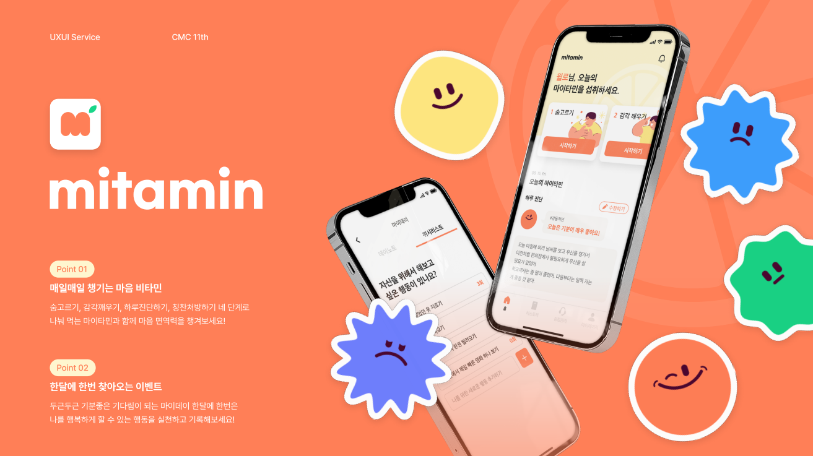

# 💊마음 면역력을 키우는 멘탈케어 서비스 마이타민

# 💊 프로젝트 소개 
11th makeus CMC 참잘했어요 팀 - 대상 수상하였습니다.

마음에도 면역력이 필요하다는 사실, 알고 계신가요? 마이타민은 매일매일 꾸준히 챙겨먹는 비타민 같은 서비스가 되어 여러분의 마음 면역력을 키우는데 도움이 되는것을 목표로 하고 있습니다.

■ 숨 고르기, 감각 깨우기
- 회고 전에 짧은 명상으로 긴장을 이완해보세요.
- 호흡과 감각에 온전히 집중하고 싶다면 자동 진행도 가능해요.

■ 하루 진단하기
- 귀여운 이모지와 함께 그 날의 감정을 돌아보고
- 내가 느낀 감정의 이름을 찾아요.
- 감정을 유발한 사건을 진찰하며 하루를 마무리해보세요. 

■ 칭찬 처방하기
- 나에게 칭찬의 한 마디를 건네보세요.
- 너무 어렵다면 칭찬 카테고리를 훑어보고 다시 곰곰이 생각해보세요.

■ 마이데이
- [위시리스트]에 온전히 나를 위한 행동을 저장해두고,
- [데이노트]에 소중한 마이데이를 사진과 함께 기록해보세요.

■ 히스토리
- 그동안 차곡차곡 쌓아온 칭찬 처방전을 둘러보세요.
- 일주일 전의 나는 어떤 마음을 가지고 있었는지 한 눈에 알 수 있어요.
- 이번 달 가장 많이 느낀 감정과 전반적인 마음 컨디션을 확인해요.
<!-- 

 -->

# 🌱Download
- Play Store  https://bit.ly/mitamin_aos
- App Store  https://bit.ly/mitamin_ios

# 🍄Build with
+ JetPack(`recyclerview` , `workmanager` , `navigation` , `livedata` , `viewmodel` )
+ rxjava
+ http : `retrofit2` , `okHttp3`
+ 아키텍쳐 패턴 : `MVVM` 
+ 디자인 패턴 : `observer` , `repository`
+ 비동기 처리 : `coroutin`
+ 언어 : `kotlin`
+ 이슈 및 코드관리 : `Jira` , `Git`
+ 디자인 : `figma`
+ 오픈소스 라이브러리 : `MPAndoridChart` , `huanghaibin-dev / CalendarView(china opensource)` ,`circleImageView`

# 🌴개발기간 
2022.09.01 ~ 현재 진행 중 

# 🌲시연화면

+ [시연 화면 링크](https://unruly-nutmeg-35d.notion.site/mitamin-6dc09e5b598845259361f9bcb0f5af4a)
